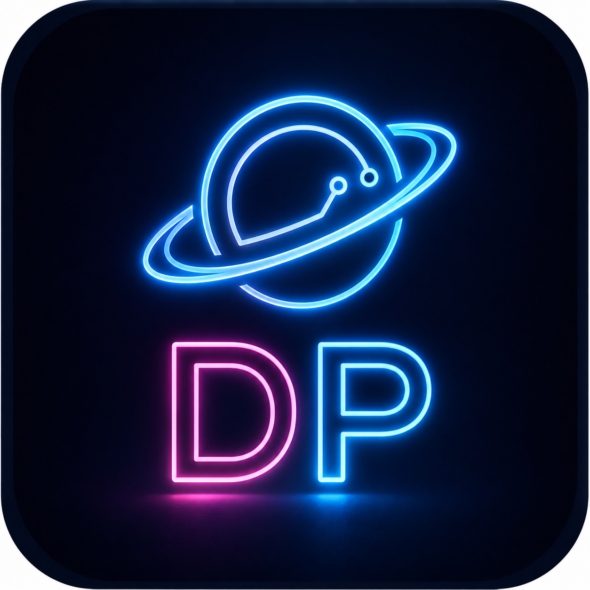
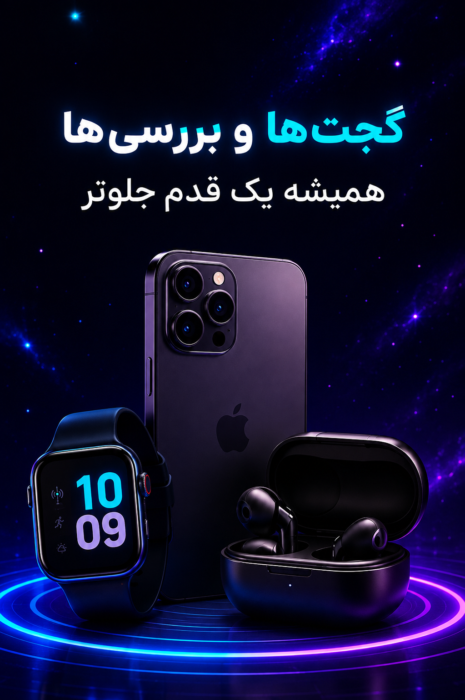

  

<h1 align="center">🌐 Digital Planet</h1>

  <strong>Learn. Build. Grow.</strong>

  A comprehensive educational app for learning programming and technology skills.

  
  
  
  

  
  

---

## 📱 About

**Digital Planet** is an educational application focused on programming, technology, and digital skills.

With simple, practical, and project-based learning experiences, Digital Planet helps users develop their technical skills step by step — from beginner concepts to more advanced topics.

Our goal is to make learning technology **simple, accessible, and engaging** for everyone.

---

## 📸 Digital Planet

  
  

  
  

---

## ✨ Features

* 📘 **Step-by-step tutorials**
  Learn programming and technology through structured lessons.

* 🛠️ **Project-based learning**
  Practice what you learn through practical projects.

* 🎯 **For different skill levels**
  Educational content for beginners and more experienced learners.

* 🎨 **Simple & modern interface**
  A clean and user-friendly experience designed for learning.

* 📝 **Quizzes & exercises**
  Reinforce your knowledge through quizzes and practical exercises.

* 📰 **Technology news**
  Stay updated with the latest technology news and developments.

* 🔄 **Regular updates**
  Educational content and application features are continuously improved.

* 🆓 **Free educational content**
  Access a growing collection of free learning resources.

---

## 📚 Learning

Digital Planet provides educational content in different areas of technology, including:

* 💻 Programming
* 🌐 Web Development
* 📱 Application Development
* 🧠 Computer Science
* 🛠️ Software Development
* 🚀 Modern Technology

More courses, topics, and learning resources will be added in future updates.

---

## ⬇️ Download

### 🌐 Official Website

  <a href="https://digitalplanet.app/">
    <strong>🌍 digitalplanet.app</strong>
  </a>

Visit the official website to learn more about Digital Planet and access the latest version.

---

### 📱 Android

  

Download the latest Android release directly from GitHub.

---

### 🟢 Cafe Bazaar

  

Download Digital Planet from Cafe Bazaar:

[Digital Planet on Cafe Bazaar](https://cafebazaar.ir/app/app.digitalplanet)

---

### 🟠 Myket

  

Download Digital Planet from Myket:

[Digital Planet on Myket](https://myket.ir/app/app.digitalplanet)

---

## 📦 Latest Version

**Version:** `v1.1.1`

**Android:** `6.0+`

**Package:** `app.digitalplanet`

---

## 🛠️ Project Status

Digital Planet is actively being developed.

New features, educational content, improvements, and performance updates will be added in future releases.

### Roadmap

* [x] Initial Android release
* [x] Programming tutorials
* [x] Quizzes and exercises
* [x] Technology news
* [x] Free educational content
* [ ] More programming languages
* [ ] More project-based courses
* [ ] More interactive learning features
* [ ] Additional educational tools
* [ ] Expanded technology content

---

## 🤝 Contributing

Suggestions, feedback, and contributions are welcome.

If you have an idea that could improve Digital Planet, you can:

1. Open an **Issue**
2. Suggest a new feature
3. Report a bug
4. Submit a **Pull Request**

Please make sure your contribution is relevant to the project and follows a clear and maintainable approach.

---

## 🐛 Bug Reports & Feature Requests

Found a bug or have an idea for a new feature?

Please open an issue on GitHub:

[🐛 Report an Issue](https://github.com/digitalplanetapp/digital-planet/issues)

When reporting a bug, please include:

* A clear description of the problem
* Steps to reproduce the issue
* Expected behavior
* Actual behavior
* Device model
* Android version

---

## 🌐 Official Links

| Platform            | Link                                                                                  |
| ------------------- | ------------------------------------------------------------------------------------- |
| 🌍 Official Website | [digitalplanet.app](https://digitalplanet.app/)                                       |
| 💻 GitHub           | [digitalplanetapp/digital-planet](https://github.com/digitalplanetapp/digital-planet) |
| 🟢 Cafe Bazaar      | [Digital Planet](https://cafebazaar.ir/app/app.digitalplanet)                         |
| 🟠 Myket            | [Digital Planet](https://myket.ir/app/app.digitalplanet)                              |
| 📦 Releases         | [GitHub Releases](https://github.com/digitalplanetapp/digital-planet/releases)        |
| 🐛 Issues           | [GitHub Issues](https://github.com/digitalplanetapp/digital-planet/issues)            |

---

## 📄 License

© 2026 **Hamed Rezaei**. All Rights Reserved.

The **Digital Planet** application, including its source code, user interface, design, branding, and related materials, is the intellectual property of **Hamed Rezaei**.

Unauthorized copying, redistribution, modification, or commercial use of the application or its source code is strictly prohibited without prior written permission.

---

  <strong>🌍 Digital Planet</strong>
   
  Learn technology. Build projects. Grow your skills.

  <a href="https://digitalplanet.app/">
    digitalplanet.app
  </a>

